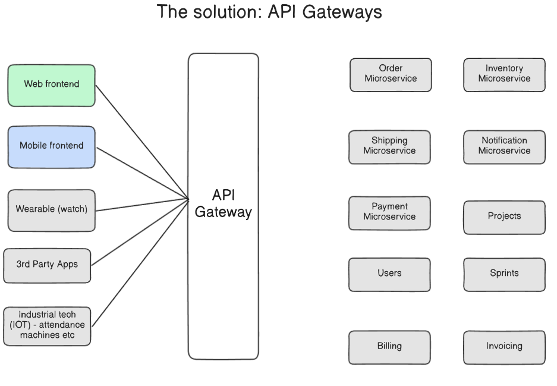
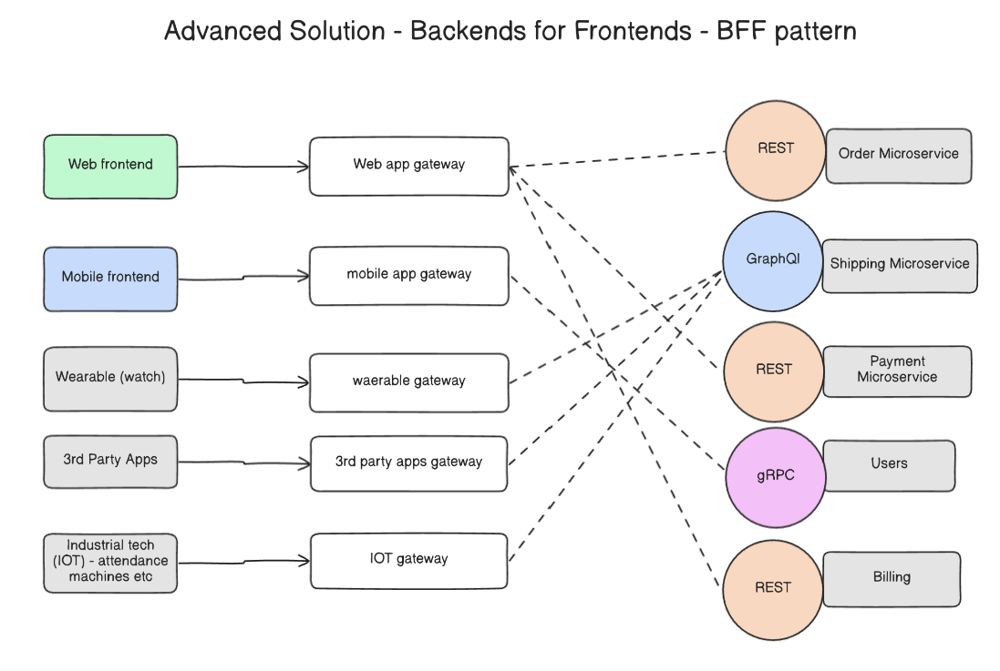
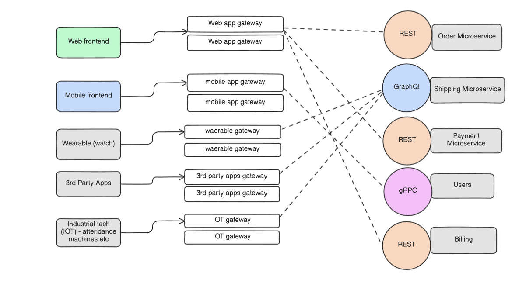
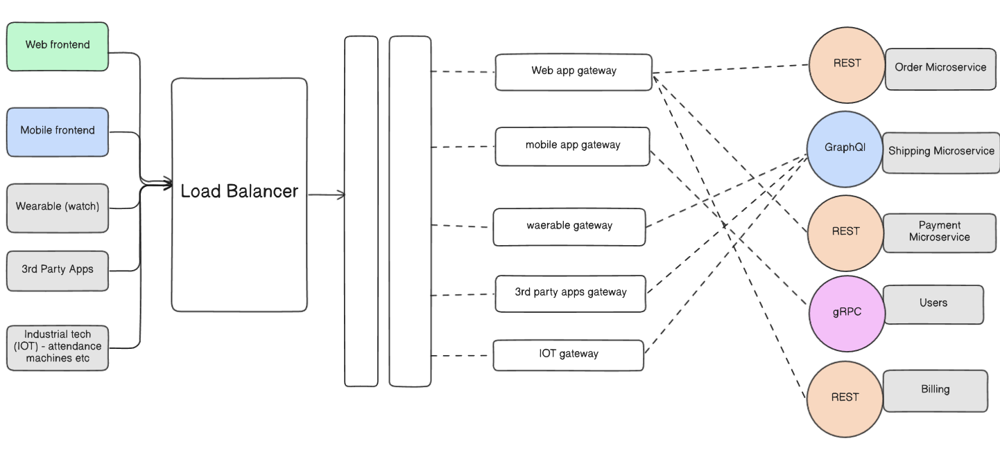

# The API Gateway Pattern: An Evolutionary Guide
When building a system with multiple microservices and various client applications (web, mobile, IoT, etc.), a critical challenge arises: how do clients efficiently and securely communicate with the services they need? The API Gateway pattern provides a solution that evolves as the system's needs for scalability and resilience grow.

## Level 1: The Central API Gateway

The initial solution to manage client-to-service communication is to introduce a single, unified entry point.

The Pattern: All incoming requests from all clients (Web Frontend, Mobile, Wearable, etc.) are directed to one central API Gateway. This gateway is responsible for routing requests to the appropriate downstream microservices (Order, Payment, Shipping, etc.).

`Benefits`:

- `Simplifies the Client`: Clients only need to know the address of one gateway, not every individual microservice.

- `Centralizes Cross-Cutting Concerns`: Logic for authentication, rate limiting, and logging can be handled in one place.

- `Enhances Security`: Microservices are not directly exposed to the public internet.

`Challenges`:

- `Single Point of Failure`: If the central gateway goes down, the entire application becomes unavailable for all clients.

- `One-Size-Fits-All API`: Different clients have different needs. A web app can handle large data payloads, while a wearable device needs a lean, minimal response. A single gateway struggles to cater to all these different requirements efficiently.

## Level 2: The Backend for Frontend (BFF) Pattern

To solve the challenges of the central gateway, the pattern evolves to provide a tailored experience for each client type.

The Pattern: Instead of a single gateway, a dedicated gateway is deployed for each specific type of frontend. For example, there is a Web app gateway for the web client and a separate mobile app gateway for the mobile client.

`Benefits`:

- `Tailored Experience & Flexibility`: Each BFF can provide an API optimized for its client. The mobile BFF can use GraphQL to minimize data transfer, while the web BFF uses REST. The wearable BFF can interact with backend services using high-performance gRPC.

- `Improved Uptime`: The gateways are isolated. If the mobile app gateway fails, the Web frontend and other clients remain completely unaffected.

- `Enhanced Scalability`: Each gateway can be scaled independently based on the traffic from its specific client.

- `Reduced Latency`: The BFF can aggregate data from multiple downstream services and return it to the client in a single response, reducing the number of network round-trips.

## Level 3: The Distributed API Gateway (High Availability)

For mission-critical applications that require maximum resilience, the BFF pattern is evolved further to eliminate any remaining single points of failure.

- `The Pattern`: This "expert level" solution introduces redundancy. Instead of a single instance for each BFF, multiple, identical instances are deployed for each client type (e.g., two Web app gateways, two mobile app gateways, etc.). A load balancer would distribute incoming traffic across these instances.

- `Primary Benefit`: Fault Tolerance. As the diagram notes, "if a particular gateway goes down, there are others to handle the requests." This ensures high availability for each client type, as the failure of a single gateway instance does not cause an outage.

## Level 4: The Distributed API Gateway (High Availability for BFFs)

Finally, to achieve maximum resilience, the principles from Level 2 are applied to the BFFs from Level 3.

- `The Pattern`: This "expert level" solution combines the BFF pattern with high availability. Instead of a single instance for each BFF, multiple, identical instances are deployed for each client type and placed behind a load balancer.

- `Primary Benefit`: End-to-End Fault Tolerance. As the diagram notes, "if a particular gateway goes down, there are others to handle the requests." This ensures that each client type has a highly available, scalable, and tailored entry point into the microservices ecosystem.