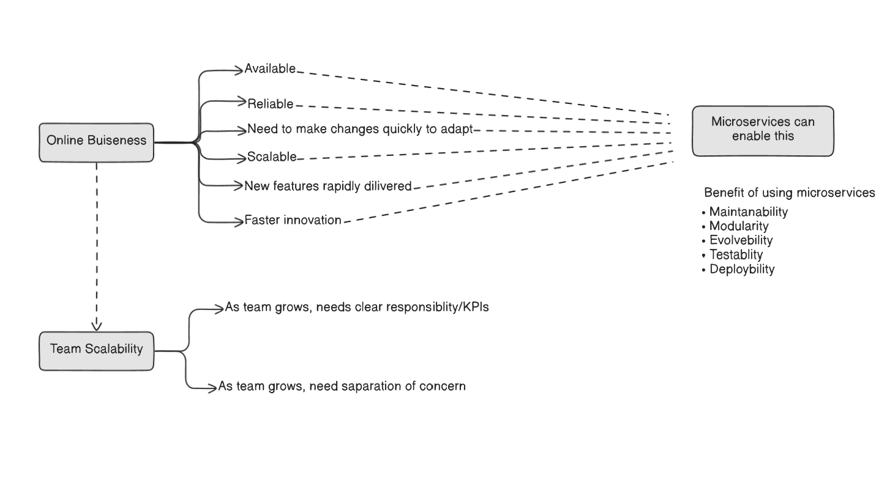

## 📈 Key Business Requirements

As shown in the diagram, a modern online business requires several key attributes to succeed and stay competitive. These needs often drive the system's architecture.

- `Availability & Reliability`: The service must be consistently online and dependable for its users.

- `Adaptability`: The business must be able to make changes quickly to adapt to market demands.

- `Scalability`: The system must handle growth in users and data without a decline in performance.

- `Rapid Feature Delivery`: The ability to release new features quickly is a significant competitive advantage.

- `Faster Innovation`: The overall pace of developing and launching new ideas must be high.

## 🧑‍🤝‍🧑 Team Scalability Challenges
The diagram also illustrates that as a development organization grows, its structure and processes face new pressures that can slow down progress.

- `Clear Responsibility/KPIs`: When teams expand, they need clear ownership over their domain to work efficiently and be accountable for their goals.

- `Separation of Concern`: To avoid development bottlenecks, teams must be able to work on different parts of the system independently without creating conflicts.

## ✅ The Microservices Solution
The diagram concludes by positioning microservices as the architectural pattern that `can enable` the fulfillment of these business and team requirements. It achieves this through a set of inherent benefits:

- `Modularity & Maintainability`: By breaking the system into smaller pieces, each part is easier to understand and maintain.

- `Evolvability`: The architecture is designed to change and evolve over time without requiring a complete rewrite.

- `Testability`: Individual services can be tested in isolation, simplifying the quality assurance process.

- `Deployability`: Services can be deployed independently, allowing for faster and safer releases of new features and fixes.