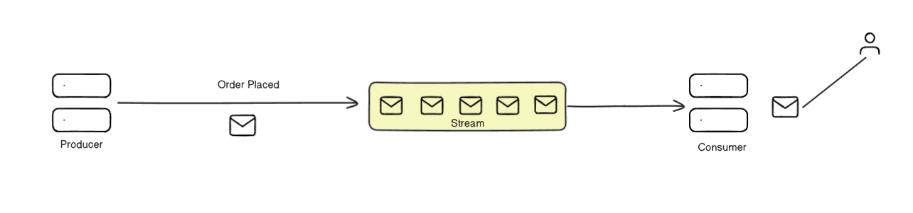
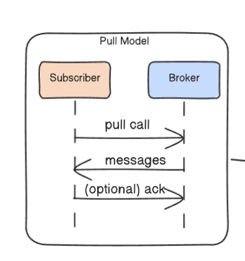
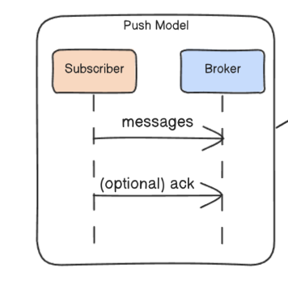

# A Comprehensive Guide to Event Streaming

Event streaming is a powerful paradigm for building real-time, scalable, and resilient applications. It centers on processing data not as static collections, but as a continuous, unbounded flow of events. This document covers the fundamental concepts, components, features, and patterns of event streaming platforms.

## 1. What is an Event Stream?
An event stream is a continuous, sequential, real-time flow of events. Think of it as a conveyor belt of data that never stops. An event can be anything that happens in your system, like an "Order Placed" or a "User Logged In." Once in a stream, these events can be used for various processes, including:

- **Aggregations**: Performing real-time data calculations like means, sums, and standard deviations.

- **Ingestion**: Adding the streaming data to databases or data warehouses.

## 2. How it Works: The Lifecycle of an Event
The journey of an event through a streaming platform follows a clear lifecycle:

- **Event Generation**: A producer application creates an event in response to an action.

- **Event Publishing**: The producer sends the event to a specific topic on the streaming platform.

- **Event Storage**: The platform's brokers store the event durably for a predetermined period, making it available for consumption.

- **Event Consumption**: A consumer application processes the event data. This can happen in real-time as the event arrives or be compiled for later batch processing.

- **Event Delivery**: The broker delivers the event to all subscribed consumers based on defined delivery semantics, such as "at least once" (guaranteed delivery, but duplicates are possible) or "exactly once" (guaranteed delivery with no duplicates).

- **Event Processing**: The consumer uses the event data to perform an action, such as transforming data, updating a database, or triggering a complex workflow.

## 3. Key Components of a Streaming Platform
Event streaming platforms are built on a few core components that work together:

- **Brokers**: These are the servers that form the backbone of the streaming platform. They manage data storage, handle event replication, and enable communication between different applications, even if they are written in different languages.

- **Topics**: Topics are named channels or categories to which events are published. They act as the "subject" for events, allowing consumers to subscribe only to the data they are interested in.

- **Partitions**: Topics can be subdivided into partitions. This allows multiple consumers to read from a single topic in parallel, dramatically increasing throughput while still guaranteeing the order of events within each partition.

- **Offsets**: An offset is a unique, sequential ID given to each event within a partition. Consumers use offsets to track their reading progress, allowing them to disconnect and later resume processing from the last known offset.

## 4. Core Features of Modern Streaming Systems
Advanced streaming platforms offer powerful features for building robust applications:

- **Exactly-Once Processing**: A strong delivery guarantee that ensures each event is processed exactly one time, preventing data duplication even in the case of failures.

- **Backpressure**: A data flow control mechanism. If a consumer is overwhelmed with incoming events, it can signal the producer to slow down or stop sending data, preventing the system from being overloaded.

- **Consumer Groups**: A group of consumer instances that work together to process events from a topic. The platform assigns partitions among the consumers in a group, ensuring that each partition is handled by only one consumer from that group, which enables scalable, parallel processing.

- **Watermarking**: A technique used in time-sensitive processing to track the progress of event time. It helps the system determine when a set of data for a specific time window can be considered "complete."

- **Data Retention and Compaction**: Streaming platforms offer customizable policies for how long event data is stored. Data compaction is a process that removes redundant or old events from a topic, keeping the storage footprint small while preserving the most essential data.

## 5. Advantages of Event Streaming
Adopting an event streaming model provides several key architectural benefits:

- **Decoupling**: Publishers and subscribers are completely decoupled; they do not need to know about each other's existence.

- **Team Independence**: Different teams can work on different consumer services that react to the same events without needing to coordinate their development or deployment cycles.

- **Reliability**: Event streams are durable. If a consumer application goes down, events are not lost; they remain in the stream, ready to be processed once the consumer comes back online.

- **Real-Time Feedback**: The continuous flow of events allows for real-time state updates across the system, enabling dynamic and responsive user experiences.

## 6. Understanding Delivery Models
Streaming platforms offer flexible models for how producers and consumers interact.

**Connection Initiation**: The connection can be broker-initiated (where the broker needs to know about subscribers, e.g., via webhooks) or subscriber-initiated (where the subscriber connects to the broker, which is more flexible for dynamic environments).

Data Flow: The Push vs. Pull Model:

- **Pull Model**: The subscriber periodically queries the broker to ask for new events. The subscriber is responsible for maintaining its own state (e.g., its offset).

- **Push Model**: The broker actively pushes events to subscribers as they become available. The subscriber is passive and does not need to manage its own state.

**Consumer Delivery Options**:

**Broadcast (Fan-out)**: All subscribers to a topic receive a copy of every event. This is useful for cases like updating the state of multiple client devices that do not share state.

**Shared Queue (Consumer Group)**: When subscribers are part of a consumer group, each event is delivered to only one subscriber within that group. This is the standard model for scalable processing, ensuring that a task is performed exactly once by the group.

## 7. A Common Pitfall: The Event Bloat Problem
A frequent challenge in event-driven architectures is Event Bloat, where events carry excessive, redundant, or irrelevant data, leading to performance issues and higher costs.

- **Example**: An OrderPlaced event that includes the entire customer profile (name, address, purchase history) when most consumers only need the CustomerID.

### **How to Fix**:

- **Only Include Essential Data**: Keep event payloads lean and focused.

- **Reference External Data**: Instead of embedding large objects, include an ID (like CustomerID) that consumers can use to fetch more details if necessary.

- **Use Event Envelopes**: Structure complex events with metadata so that consumers can easily identify and process only the parts of the event that are relevant to them.