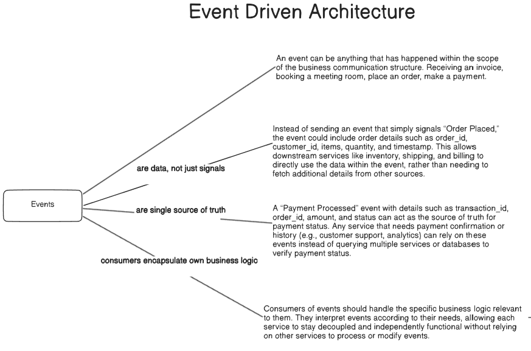
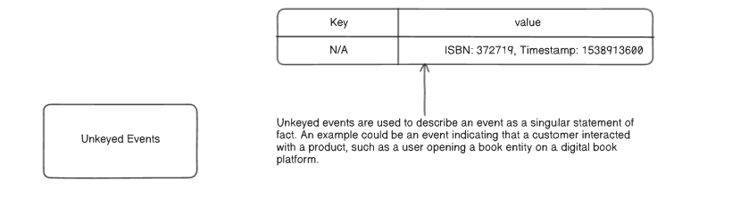
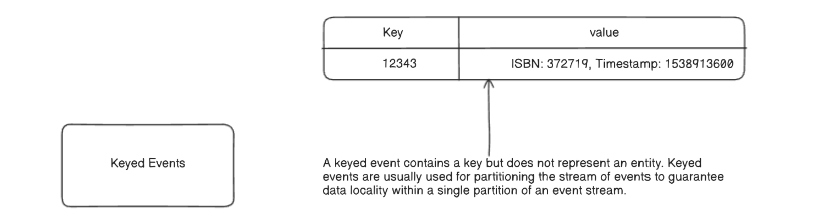
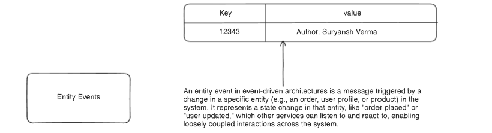

# Principles of Event-Driven Architecture and Design

Event-Driven Architecture (EDA) is a powerful paradigm where decoupled services communicate by producing and consuming events. The quality and design of these events are critical to the success of the system. This document outlines the core philosophy, design best practices, and common patterns for events.

## 1. The Core Philosophy: What is an Event?
An "event" is more than just a simple notification. It's a rich, self-contained record of a significant business occurrence.

- `Events are Data, Not Signals`: An event should contain all the necessary data about what happened. For example, instead of a simple "Order Placed" signal, the event should include the order_id, customer_id, items, and timestamp. This allows consuming services (inventory, shipping, etc.) to act on the data directly without needing to make follow-up API calls to fetch more details.

- `Events are the Single Source of Truth`: An event represents an immutable fact. A Payment Processed event, with its transaction_id and amount, becomes the authoritative record of that payment. Services that need payment status can rely on this event stream as the source of truth rather than querying multiple databases.

- `Consumers Encapsulate Their Own Logic`: This is key to decoupling. A single event, like Product Added to Cart, can be consumed by multiple services. The Inventory Service might decrement stock, while the Recommendation Service uses it to suggest related products. Each service reacts to the same event according to its own independent business logic.

## 2. Best Practices for Designing Events
Effective event design simplifies the system and makes it easier to maintain and scale.

- `Keep Events Single-Purpose`: An event should describe a single, atomic business fact. Avoid creating a generic OrderEvent that contains information about both order status and inventory changes. Instead, emit two distinct, single-purpose events.

- `Use One Event Type Per Stream`: Do not mix different types of events (e.g., OrderCreated, OrderCancelled) in the same stream or topic. Creating a dedicated stream for each event type (e.g., OrderShippedEvents) allows consumer services to subscribe only to the events they care about, which simplifies their logic and reduces unnecessary processing.

- `Consider the Consumer's Needs`: Design events to include the data your consumers need, but no more. An OrderShipped event should include the orderId and shippingDate, but not the entire order history.

- `Use the Narrowest Data Type`: Be specific with data types (e.g., int for numbers, boolean for true/false) instead of using generic strings. This improves clarity, validation, and understanding for consumers.

- `Minimize Event Size`: Keep events lightweight by including only essential data. For example, a PurchaseCompleted event should contain a list of product IDs, not the full, detailed product descriptions.

## 3. A Typology of Events
Events can be categorized based on their structure and purpose, particularly concerning their key.

- `Unkeyed Events`: A simple statement of fact that isn't tied to a specific entity's lifecycle. It represents a singular occurrence, such as a user interacting with a product.

- `Keyed Events`: An event that contains a key (e.g., a user_id) but doesn't represent the full entity state. These are primarily used for technical purposes like partitioning an event stream to guarantee that all events for a specific key are processed in order by the same consumer instance.

- `Entity Events`: The most common type in EDA. An entity event represents a state change for a specific business entity, such as Order Placed or User Updated. These events form the backbone of communication between loosely coupled services.
