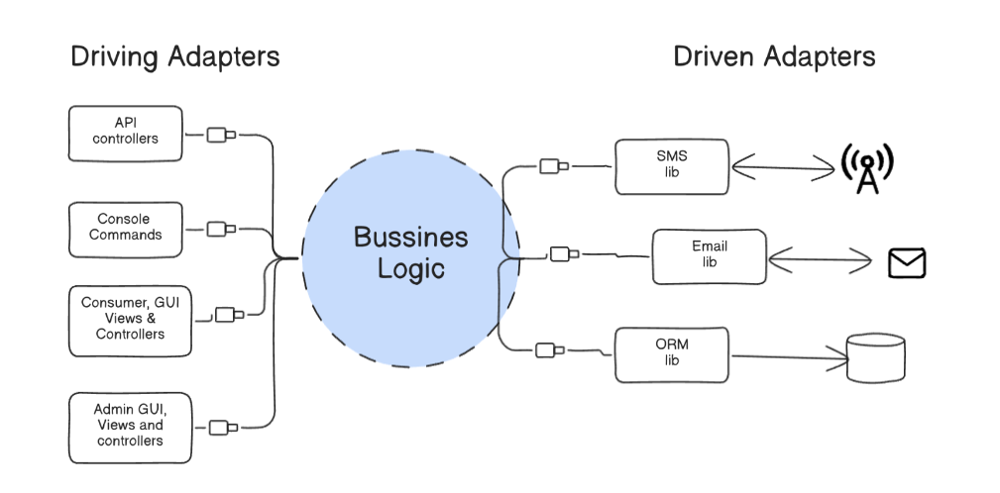
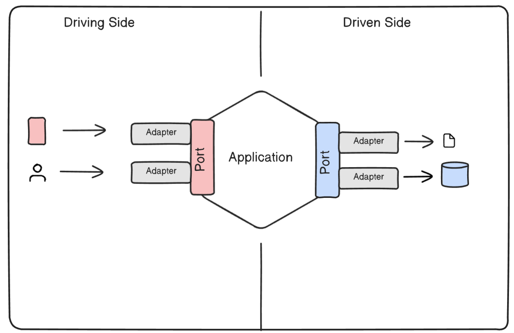
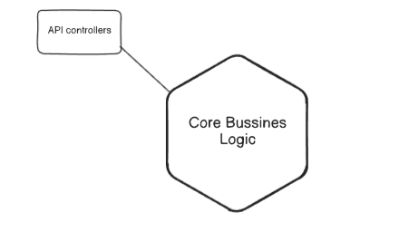
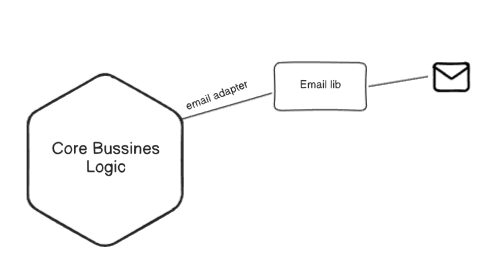

# A Guide to Hexagonal Architecture (Ports and Adapters)

Hexagonal Architecture, also known as the Ports and Adapters pattern, is an architectural style designed to create a clean separation between the core application logic and the external technologies it interacts with. It creates a protective abstraction layer around the core, making the system technology-agnostic, adaptable, and highly testable.

## 1. The Core: The Application (The Hexagon)

At the very center of the architecture is the Application. This is the "hexagon" and it represents the isolated core of your system.

**Purpose**: The Application contains all the pure business logic and rules of your domain (the Domain Model) and the services that orchestrate this logic (Application Services).

**Key Principle**: The first key concept is to keep all the business models and logic in a single, protected place. The second is that each hexagon should be independent and self-contained. The Application knows nothing about the outside world or the technologies used to interact with it.

## 2. The Boundaries: Ports
A Port is a technology-agnostic gateway that defines how the Application can be communicated with. It is essentially a formal interface that dictates a contract for interaction, without specifying any technology.

- **Inbound Ports (Driving Ports)**: These define the API of the core application. They are the entry points through which the outside world can interact with the Application's functionality.

- **Outbound Ports (Driven Ports)**: These are interfaces that define what the core application needs from the outside world. For example, the Application might require a "UserRepository" port to save user data, defining methods like save(user) and findById(id).

## 3. The Bridge: Adapters
An Adapter is the technology-specific code that bridges the gap between the outside world and a Port. It transforms an external technology's specific API into the technology-agnostic interface defined by the Port.

**Driving Adapters (Primary)**: These are adapters on the "driving side" that initiate actions in the application. They adapt an external request into a call to an inbound port.

Examples: A REST API controller that takes an HTTP request and calls a method on an Application Service, or a web view controller that takes user input from a form.

**Driven Adapters (Secondary)**: These are adapters on the "driven side" that are called by the application. They are concrete implementations of an outbound port.

Examples: A PostgreSQL adapter that implements the UserRepository outbound port, or an email adapter that implements a NotificationService outbound port.

## 4. The Two Sides: Driving vs. Driven
The architecture is conceptually divided into two sides, representing the flow of control.

- **The Driving Side (Left)**: This side contains the primary actors that "drive" the application—they initiate the interaction. This could be a user clicking a button, a test script, or another automated system.

- **The Driven Side (Right)**: This side contains the secondary actors that are "driven by" the application—they are called by the application to perform a task. This includes databases, external APIs, message queues, and other infrastructure concerns.

## 5. Key Benefits of Hexagonal Architecture
Adopting this pattern provides two primary advantages:

- **Complete Isolation and Testability**: The core application logic has no dependencies on external factors like databases or web frameworks. This makes testing incredibly easy, as all outbound ports can be "mocked" with simple, in-memory implementations.

- **No Technology Lock-in**: You design your system's interfaces based on purpose rather than technology. This prevents you from being locked into a specific tech stack. If you need to change your database from PostgreSQL to MongoDB, or allow your app to be called by a Slack bot instead of a web browser, you simply write a new adapter. The core application logic remains completely unchanged.