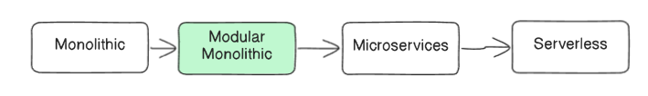
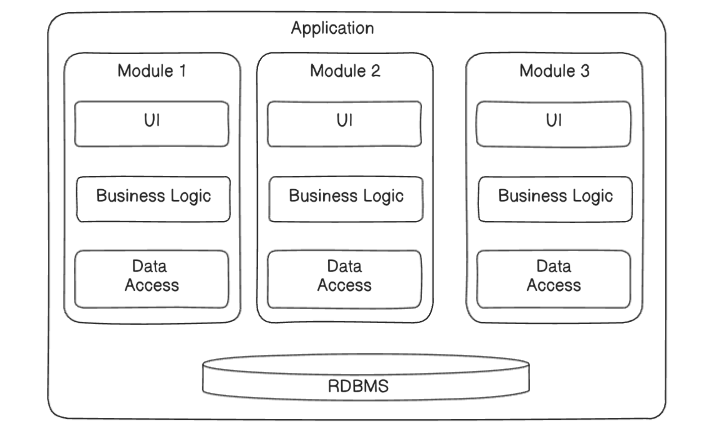
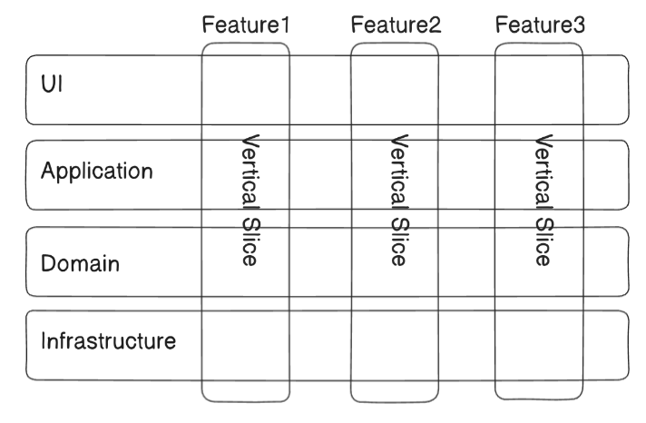

# Beyond Microservices: The Case for the Modular Monolith

While microservices are a powerful architectural style, they are not a universal solution. The complexity and operational overhead they introduce can be counterproductive in many scenarios. Understanding when not to use them is as important as knowing when to apply them. This document explores the scenarios that favor simpler architectures and presents the Modular Monolith as a compelling and pragmatic alternative.

## 1. When to Avoid Microservices
Before choosing a microservices architecture, consider if your project fits any of the following criteria. If so, a simpler approach may be more effective:

- The application isn't expected to scale rapidly.

- The business domain is not well understood or is evolving quickly.

- The application's components are naturally tightly coupled.

- Your team's infrastructure or deployment capabilities are basic.

- You don't need to scale different parts of the application independently.

- Inter-service latency would be problematic (e.g., for real-time data exchange).

- Regulatory or compliance needs favor centralized control and data management.

- The application doesn't require high availability or complex fault tolerance.

- You are building an internal application with a limited number of users.

## 2. The "In-Between" Solution: The Modular Monolith

For teams looking for a middle ground between a traditional monolith and a complex microservices ecosystem, the Modular Monolith is an excellent choice.

### What is a Modular Monolith?
A Modular Monolith is a software application that is built and deployed as a single unit but is internally structured into well-defined, independent modules.

**Structure**: While it typically runs as a single process and connects to a single database, the application's code is strictly organized into modules. Each module is responsible for a "vertical slice" of a feature, encapsulating its own UI, Business Logic, and Data Access code. This enforces strong logical boundaries within the codebase.

## 3. The Benefits of a Modular Monolith
This approach provides many of the organizational benefits of microservices without the operational overhead.

- **Encapsulated Business Logic**: The main benefit is that business logic is clearly encapsulated within modules. This enables faster shipping of features while ensuring data remains consistent and communication patterns are simple (in-process calls instead of network calls).

- **Reusable Code & Easy Refactoring**: Modular components can be reused across the application. Since dependencies are more organized and visible, changing or refactoring one module has less or no effect on other modules.

- **Less Complexity and Cost**: It is far easier to manage, maintain, and upgrade a single application than hundreds of distributed microservices. A Modular Monolith can run on basic infrastructure, keeping operational costs low.

## 4. Trade-offs and Ideal Use Cases
The Modular Monolith is a strategic choice with its own set of trade-offs.

### Challenges
- **No Technology Diversification**: Because it is a single application, you cannot use different technology stacks (polyglot) for different modules.

- **Single Unit of Scale & Deployment**: The entire application must be scaled and deployed as one unit. You cannot scale the "Products" module independently of the "Users" module. Eventually, performance or scalability limits might force a move to microservices.

### When to Use a Modular Monolith
This architecture is the ideal choice in several specific scenarios:

- **For small-scale projects that need strict consistency**: For example, a project involving financial transactions on a bank account is better off with the strong consistency of a monolith.

- **As an intermediate stage for modernization**: When refactoring a legacy application, a modular monolith is an excellent stepping stone. It allows you to untangle the code and establish clear boundaries, preparing it for a potential, future migration to microservices without a risky "big bang" rewrite.

- **For new/greenfield projects**: A modular monolith allows a team to learn their domain and build the architecture quickly without the immediate Day 1 overhead of Kubernetes, service mesh, and distributed system complexity. You can move to microservices much later in your delivery timeline, perhaps after the project becomes profitable and the scaling needs are clear.