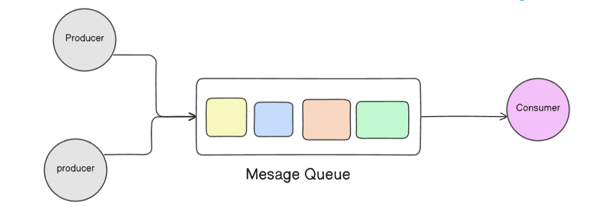

# A Deep Dive into Asynchronous Messaging: Queues and the Publish-Subscribe Pattern
Asynchronous messaging is a critical paradigm for building modern, decoupled, and scalable applications. It revolves around components communicating without waiting for direct responses. This document provides a detailed explanation of this concept, starting with the fundamental building block of Message Queues and then exploring the powerful Publish-Subscribe (Pub/Sub) pattern that extends its capabilities.

## 1. The Foundation: Message Queues

At its core, asynchronous communication relies on a lightweight buffer component called a Message Queue.

### What is a Message Queue?

A message queue acts as an intermediary channel between software components.

- `Producers and Consumers`: A component called a Producer adds a message to the queue. The message is stored securely in the queue until another component called a Consumer retrieves it for processing.

- `Message Content`: Messages are typically small and can be anything from simple text information to complex objects representing requests, replies, or error messages.

- `Point-to-Point Communication`: By default, many producers can add messages to a queue, and many consumers can process messages from it. However, a key characteristic is that each individual message is processed only once, by a single consumer. This makes it a point-to-point communication model.

### Core Benefits of Using Queues
- `Better Performance`: Enables asynchronous communication, meaning producers can add requests to the queue without waiting for them to be processed. Consumers process messages only when they are available. This optimizes data flow and prevents any component from being stalled.

- `Increased Reliability`: Queues make your data persistent. If a consumer goes offline, messages remain in the queue. This creates fault tolerance, as the other parts of the system can continue to interact with the queue, which can also be mirrored for even more availability.

- `Granular Scalability`: Queues make it possible to scale precisely where you need to. As workloads peak, you can add more consumer instances to process messages faster. Producers, consumers, and the queue itself can all grow and shrink on demand.

- `Simplified Decoupling`: Queues remove direct dependencies between components. Software components aren't burdened with communication logic and can instead be designed to perform a discrete business function.

### Detailed Features of Message Queue Systems
Modern message queue systems offer a rich set of features to handle complex scenarios:

- `Push or Pull Delivery`: Consumers can either be pushed messages automatically when they become available (common in Pub/Sub) or can pull (continuously query) the queue for new messages.

- `Schedule or Delay Delivery:` Allows a specific delivery time to be set for messages, which is useful for scheduling future tasks.

- `At-Least-Once Delivery`: The system guarantees that a message will be delivered at least once, though duplicates are possible in the event of a failure.

- `Exactly-Once Delivery`: A stricter guarantee that ensures a message is delivered exactly once by automatically filtering out any potential duplicates.

- `FIFO (First-In-First-Out) Queues`: Guarantees that messages are processed in the exact order they were received.

- `Ordering`: A best-effort guarantee that messages are generally delivered in the same order they're sent.

- `Dead-Letter Queues (DLQ)`: A secondary queue where messages that fail to be processed successfully are sent. This prevents a "bad" message from blocking the queue and allows for later inspection and debugging.

- `Poison-Pill Messages`: A special type of message used to signal a consumer to gracefully shut down its work, similar to closing a socket.

## 2. Common Use Cases
The combination of queueing technology and the Pub/Sub pattern enables a wide range of powerful applications:

- Perform parallel asynchronous processing.

- Deliver application and system alerts to multiple systems.

- Manage complex asynchronous workflows.

- Balance workloads across a fleet of consumers.

- Log to multiple systems simultaneously.

- Use fanout for data replication.

- Coordinate serverless applications.

## 3. The Communication Pattern: Publish-Subscribe (Pub/Sub)
While a basic queue is point-to-point, the Publish-Subscribe pattern is a messaging model designed for one-to-many communication. As noted in the diagrams, "message queues can be combined with Pub/Sub messaging in a fanout design pattern" when a message needs to be processed by more than one consumer.

### The Four Key Components of Pub/Sub
- `Message`: The communication data sent from a publisher.

- `Publisher`: The component that creates and sends messages. It sends messages to a "Topic" without any knowledge of who will receive them.

- `Topic`: An intermediary channel that acts as a broadcast hub. It receives messages from publishers and maintains a list of interested subscribers.

- `Subscriber`: The message recipient. A subscriber registers (or "subscribes") to one or more topics to receive messages.

This model creates a one-to-many relationship, where the publisher and subscribers are completely decoupled.

### Core Benefits of the Pub/Sub Pattern
- `Eliminate Polling`: The pattern uses instantaneous, push-based delivery, which is more efficient and provides a faster response time than consumers having to periodically poll for updates.

- `Dynamic Targeting`: The system is more natural and less error-prone. A publisher simply posts messages to a topic, and any interested party can subscribe. Subscribers can be added, upgraded, or removed dynamically without any changes to the publisher.

- `Decouple and Scale Independently`: Publishers and subscribers work independently, allowing you to develop and scale them separately without creating ripple effects across the system.

- `Simplify Communication`: Adding new functionality (e.g., a new subscriber service) doesn't require any existing service to change.

- `Durability & Security`: Like queues, pub/sub systems offer high durability by storing messages on multiple servers. They also provide security by authenticating publishers and allowing for encrypted communication.

### Key Features Enabled by Pub/Sub
- `Push Delivery`: Subscribers are instantly notified when a message is available on a topic.

- `Multiple Delivery Calls`: Topics can connect to and push messages to many different types of endpoints, such as other message queues, serverless functions, HTTP servers, and email addresses.

- `Fanout`: This is the core scenario where a single message sent to a topic is replicated and pushed to multiple endpoints. This enables powerful parallel processing.

- `Filtering`: Subscribers can create message filtering policies so they only receive notifications for messages they are truly interested in, as opposed to receiving every single message posted to the topic.

- `Multiplexing`: In some advanced cases, publishers can also be subscribers, allowing you to create complex, internally consistent message streams and workflows.
