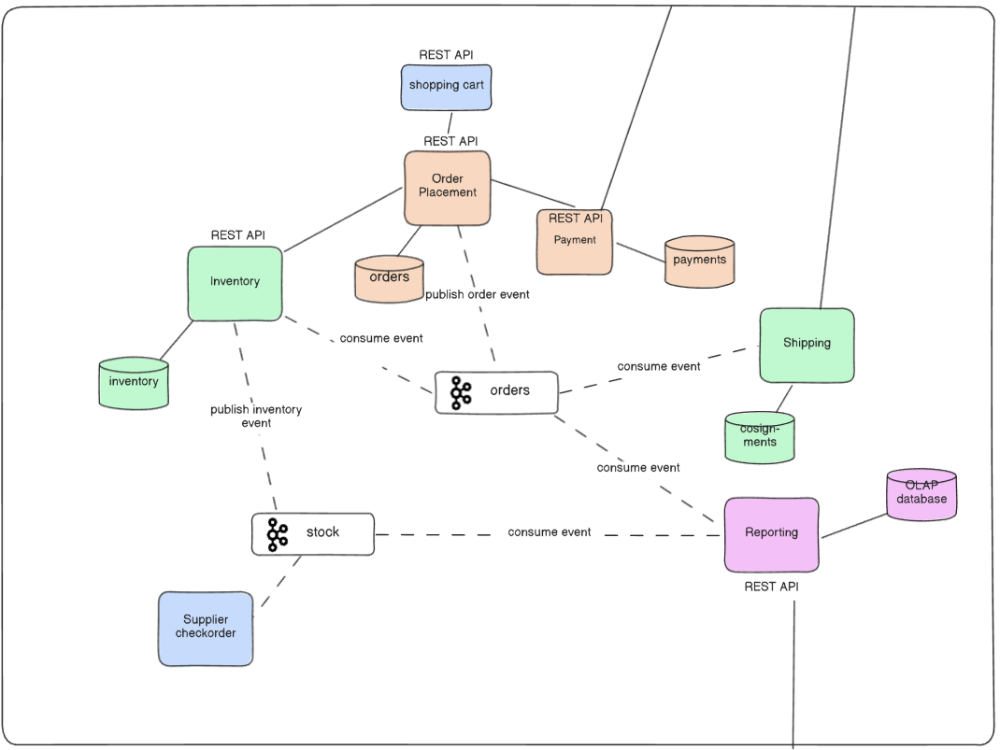
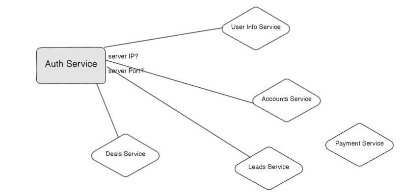
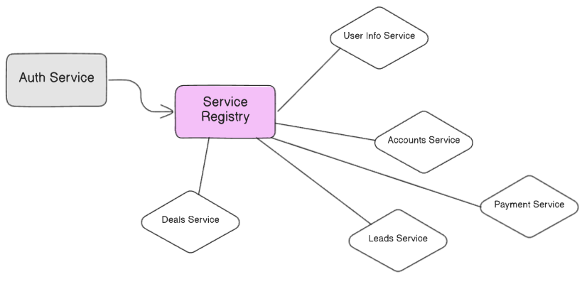

# A Comprehensive Guide to Scaling Event-Driven Systems
Scaling an event-driven system involves more than just adding servers. It requires a combination of architectural patterns, processing strategies, and specific implementation techniques to ensure reliability, performance, and efficiency under load. This document covers these concepts in detail.

## 1. Architectural Patterns for Scale
Before diving into specific techniques, two high-level architectural patterns are crucial for building a scalable system.

### The Hybrid Communication Model (Sync & Async)

A common question is whether a system based on asynchronous streams still needs synchronous APIs. The answer is yes. A healthy, scalable system often uses a hybrid model:

- **Asynchronous Messaging**: Used for internal, decoupled communication between services. This is ideal for broadcasting state changes and workflows where an immediate response is not required (e.g., an inventory service publishes an event that a reporting service consumes).

- **Synchronous APIs** (e.g., REST): Used for interactions with external systems or clients and for internal commands that require an immediate response (e.g., an Order Placement service making a direct API call to a Payment service).

### Service Discovery with Service Registries

As the number of microservices grows, deployments become more frequent and service locations (IP addresses, ports) change constantly.

**The Problem**: It becomes impossible to manually track the location of every service that needs to be called.

**The Solution**: A Service Registry acts as a dynamic "phonebook" for your services. Each service registers its current location with the registry upon startup. When another service needs to communicate with it, it queries the registry to get the up-to-date location details.

## 2. Core Scaling Strategy: Parallelism and Faster Processing
The fundamental technique for scaling event-driven systems is parallelism.

### Parallelization
Parallelization allows time-consuming problems to be broken down into smaller sub-tasks that can be executed concurrently.

- **Data Parallelism**: Executing the same task on different sets of event data.

- **Task Parallelism**: Executing different tasks altogether.

Scaling Approaches:

- **Horizontal Scaling**: Adding more stream processing instances (e.g., more servers or containers).

- **Vertical Scaling**: Adding more resources (CPU, RAM) to existing instances.

### Techniques for Faster Event Processing
In addition to adding more resources, you can speed up the processing of events themselves:

- **Event Ordering**: Using techniques like timestamps and watermarks to process events in a time-sensitive manner.

- **Event Grouping**: Grouping events based on specific fields or using shuffle grouping to optimize processing logic.

- **Windowing**: Processing events that fall within a specific time window. This can be a fixed window (e.g., every 5 minutes), a session window (e.g., based on user activity), or a sliding window (e.g., the last 1 minute of data, re-calculated every 10 seconds).

## 3. Obvious Scaling Techniques
The following methods are essential for building robust, high-performance event-driven systems:

- **Partitioning and Sharding Events**: Distribute event processing load across multiple nodes or clusters. This enables parallel processing and enhances fault isolation.

- **Event Stream Backpressure Handling**: Implement flow control mechanisms like buffering, rate limiting, and queueing priorities. This prevents downstream consumers from being overwhelmed by high loads and avoids performance degradation.

- **Idempotent Event Processing**: Design consumers to handle duplicate events gracefully. This is crucial in distributed systems where network issues can cause reprocessing, and it ensures an accurate state.

- **Dynamic Scaling and Auto-scaling Policies**: Use metrics like queue length, processing latency, or CPU usage to dynamically and automatically adjust resources, scaling up during peak times and down during lulls.

- **Optimize Data Serialization and Deserialization**: Choose high-performance serialization formats (e.g., Protocol Buffers, Avro) to reduce event message sizes and CPU load, improving network throughput.

- **Use Dedicated Clusters for Critical Event Streams**: Isolate mission-critical, high-priority event streams on their own dedicated hardware to prevent resource contention with lower-priority workflows.

- **Leverage Event Batching and Aggregation**: Reduce the frequency of individual messages and network calls by batching events. Aggregate related events when possible to minimize the number of messages processed.

- **Implement Event Sourcing for Auditing and Replayability**: Use the event store as a system of record. This allows you to replay events to recover state, scale to new consumers, or ensure data consistency.

- **Use a Schema Registry for Versioning and Compatibility**: Manage schema changes with a tool like Confluent Schema Registry. This enables different versions of services to consume events without causing deserialization errors.

- **Optimize for Consumer Lag Monitoring and Recovery**: Continuously monitor consumer lag to detect slowdowns and trigger alerts. Strategically rebalance consumers when needed to evenly distribute load and prevent bottlenecks.

- **Event Deduplication and Ordering Guarantees**: Use unique event IDs or hash-based deduplication to prevent processing duplicate events. Leverage platform features like Kafka's log compaction and ordering guarantees within partitions to maintain sequence integrity.

- **Leverage Asynchronous Processing with Non-blocking I/O**: Design consumers with non-blocking I/O models to improve scalability under high loads by making better use of system resources and minimizing wait times.

## 4. Scaling Through Code Efficiency
It's counter-intuitive, but event-driven systems can be scaled efficiently by making small, clever changes to your code, not just by adding more servers.

- **Acknowledgement**: Implement a mechanism where a consuming component can "acknowledge" that it has successfully received and processed data. If the producer doesn't receive an acknowledgment, a re-try can be initiated, ensuring reliable delivery.

- **Checkpointing**: Periodically save the current state of a long-running process. Just like saving your progress in a video game, checkpointing allows a system to resume from the last known good state after a failure, rather than having to restart the entire process from the beginning.