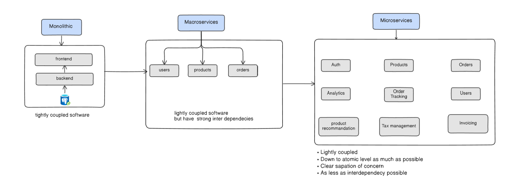
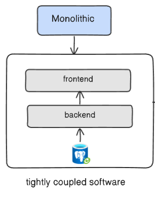
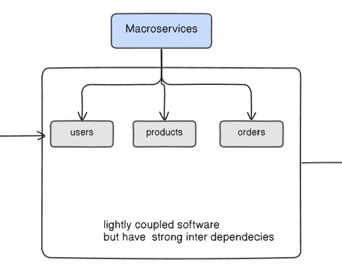

# The Architectural Evolution: From Monolith to Microservices

This diagram illustrates a common and pragmatic journey of software architecture evolution. It showcases the transition from a single, unified application to a collection of fine-grained, independent services. Each stage represents a strategic response to the growing complexity and scale of the system.

## 1. Monolithic Architecture

  

The journey begins with the monolith. This architecture is characterized by a single, unified codebase containing all business logic.

- `Structure`: As shown, the application consists of a tightly integrated frontend and backend, both connected to a single, shared database.

- `Coupling`: The diagram correctly labels this as "tightly coupled software." A change in one part of the system (e.g., the backend) can have unforeseen impacts on other parts, making development, testing, and deployment slow and risky. All components are scaled and deployed together as a single unit.

## 2. Macroservices (Intermediate Stage)

  

As the monolithic application grows, managing its complexity becomes more complex. The first logical step in decomposition is to break it into macroservices.

- `Structure`: The monolith is split into a few large, coarse-grained services based on major business domains, such as users, products, and orders.

- `Coupling and Interdependency`: This stage represents an improvement but is not the final goal. The diagram notes that while the services are separate deployments ("lightly coupled software"), they "have strong inter-dependencies." This means the services are still logically entangled. For example, the orders service might directly call the products and users services in a synchronous, blocking way, creating a fragile chain. This inter-dependency is the primary reason for evolving further.

## 3. Microservices

  

This diagram illustrates the **microservices architecture**, the target state of a full system decomposition. At this stage, the application is no longer a single unit or a collection of large components. Instead, it is a suite of small, independently deployable services.

Each service is designed around a specific business capability, such as `Auth`, `Products`, `Orders`, or `Invoicing`. This fine-grained approach aims to maximize agility, scalability, and resilience.

### 🧩 Decomposition and Atomicity

The primary goal of this architecture is to break down functionality to its most fundamental, or **atomic**, level.

* **Single Responsibility:** Each microservice has a single, well-defined purpose. For example, the `Tax Management` service handles only tax calculations, and the `Product Recommendation` service is solely responsible for generating recommendations.
* **Decentralization:** By splitting the system into components like `Users`, `Orders`, and `Analytics`, we avoid a central, monolithic database and business logic layer. Each service manages its own data and logic, promoting team autonomy and simplifying maintenance.

### 📝 Core Principles

The effectiveness of a microservices architecture is guided by the core principles highlighted in the diagram. These principles address the challenges of highly distributed systems.

* **Lightly Coupled:** Services should have minimal direct knowledge of or reliance on each other. Communication typically happens over well-defined APIs (e.g., REST) or through an event bus, preventing changes in one service from breaking others.
* **Atomic Level Decomposition:** Services are broken down to the smallest practical unit of functionality that provides business value. This "atomic" nature ensures a service does one thing and does it well.
* **Clear Separation of Concern:** This is the foundational idea. By separating concerns into distinct services (`Auth` vs. `Order Tracking`), the system becomes easier to understand, develop, and test. Each team can focus on their specific domain without needing to understand the entire system's complexity.
* **Minimal Inter-dependency:** Reducing dependencies between services is critical for independent deployment and fault tolerance. If the `Invoicing` service fails, it should not cascade and cause the `Products` or `Analytics` services to fail. This is the ultimate goal of decoupling.
