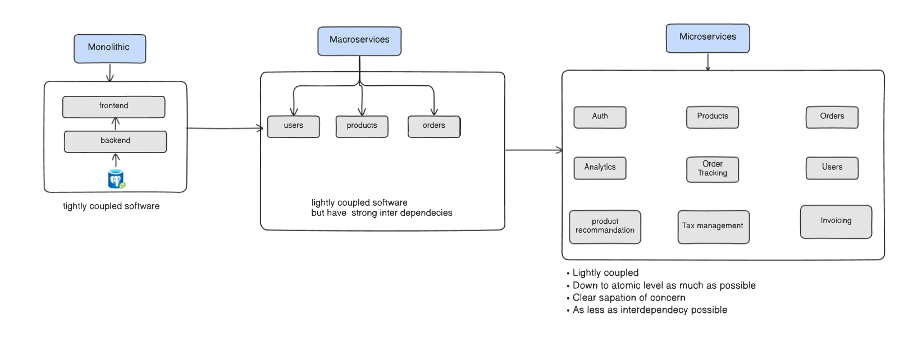
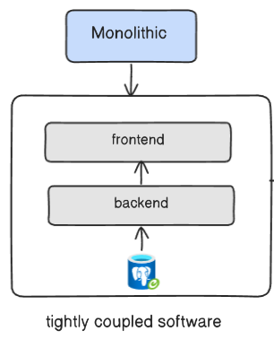
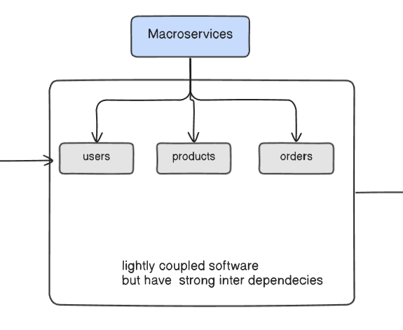
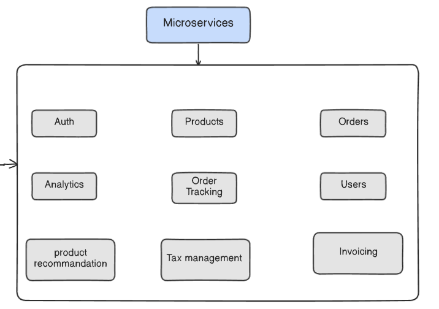

# Transition: Monolith → Macroservices → Microservices
The decomposition process is often evolutionary, starting from a tightly-coupled monolithic system and gradually progressing toward a fully decoupled microservices architecture. The image below captures this transformation:

## 1. Monolithic Architecture
- All components (frontend, backend, and database) are part of a single deployable unit.

- Codebase and responsibilities are tightly coupled.

- A change in one part (e.g., user logic) may affect unrelated areas (e.g., order processing).

- Scaling must occur at the entire application level.

  

## 2. Macroservices (Intermediate Stage)
- The monolith is split by major business domains like Users, Products, and Orders.

- These are now separate services, but still share strong interdependencies.

- This stage helps in:

  - Establishing clear domain boundaries.

  - Introducing basic service-level autonomy.

  - Easing the transition toward microservices.

  

## 3. Microservices
- Macroservices are further decomposed into atomic services, each with a single responsibility:

- Auth, Analytics, Order Tracking, Tax Management, Invoicing, etc.

- Each service is independently deployable, scalable, and testable.

- Promotes:

  - Separation of concern

  - Light coupling

  - Minimal interdependency

  

