# Lenses for Viewing Microservices

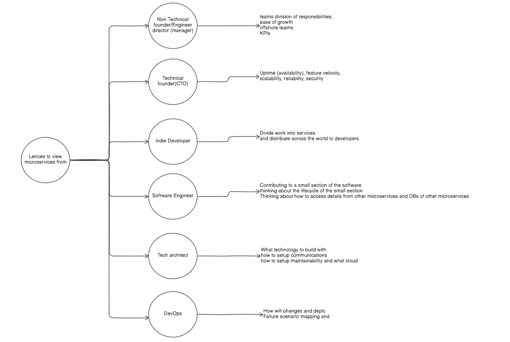

This diagram illustrates that a microservices architecture is not viewed uniformly across an organization. Instead, different roles interact with it through unique "lenses," each with its own set of priorities and concerns.

## Leadership & Strategic View
- `Non-Technical Founder / Engineer Director`: Focuses on the organizational impact. Their primary concerns are team structure, division of responsibilities, managing team growth (e.g., offshore teams), and setting Key Performance Indicators (KPIs).

- `Technical Founder (CTO)`: Takes a high-level view of the system's technical health and business impact. They prioritize uptime (availability), feature velocity, scalability, reliability, and security.

## Development & Implementation View
- `Indie Developer`: Focuses on the initial project architecture and workflow. Their main task is to divide work into services and figure out how to distribute that work across developers.

- `Software Engineer`: Has a focused, hands-on perspective. They are concerned with contributing to a small section of the software, the specific lifecycle of that small section, and how to access data from other microservices and their databases.

## Architecture & Operations View
- `Tech Architect`: Responsible for the system's foundation. They decide what technology to build with, how to set up communications between services, how to ensure long-term maintainability, and what cloud infrastructure to use.

- `DevOps`: Focuses on the operational reality of running the system. As shown in the diagram, their concerns include how changes and deployments will work and creating failure scenario mapping to ensure resilience.

# Architecture Evolution in a High-Growth Startup (Non Technical founder Perspective)

## Stage 1: The Monolithic Startup

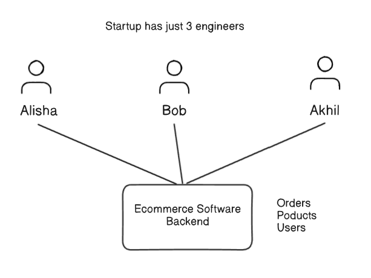
The journey begins with a small, agile team focused on finding product-market fit.

- `Initial State:` A team of just three engineers (Alisha, Bob, and Akhil) works on a single, monolithic "Ecommerce Software Backend" that handles all core domains: Orders, Products, and Users.

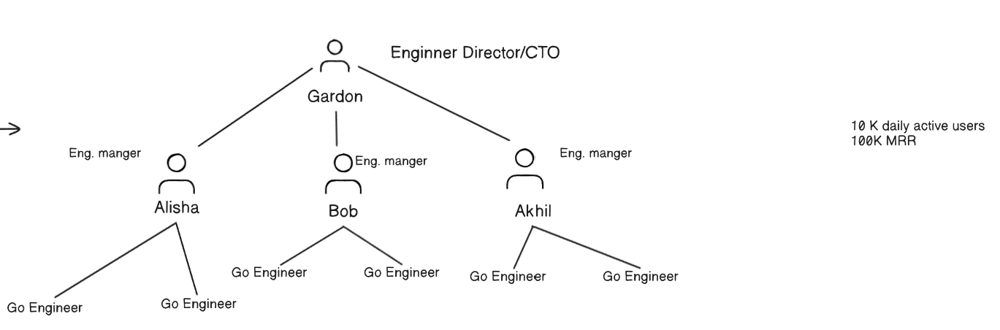

- `Trigger for Change:` The product is successful, leading to a sudden increase in demand. The company grows to 10K daily active users and 100K in Monthly Recurring Revenue (MRR).

- `First Team Growth:` To manage this growth, the team expands. A formal management structure is introduced with an Engineering Director/CTO (Gordon), and the original engineers become managers of newly hired engineers.

## Stage 2: The First Split - Aligning Teams with Macroservices

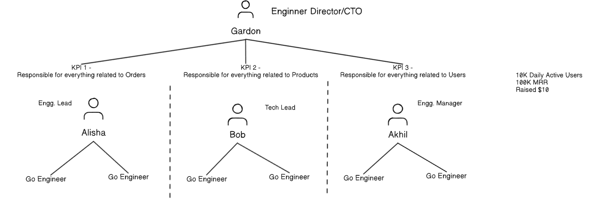
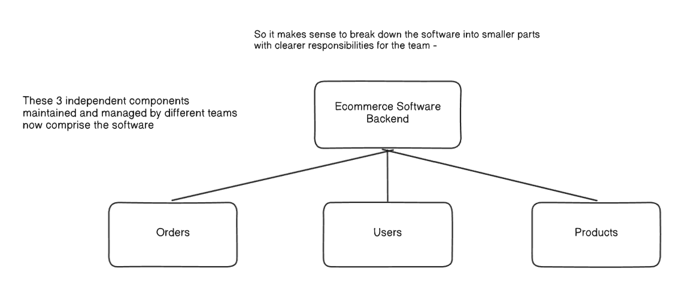

With a larger team, the monolithic structure becomes inefficient. The next logical step is to introduce clearer boundaries.

- `The Motivation`: As the diagram states, "it makes sense to break down the software into smaller parts with clearer responsibilities for the team."

- `Architectural Change`: The single backend is decomposed into three large, independent components, or macroservices: Orders, Users, and Products.

- `Conway's Law in Action:` The organizational structure is explicitly aligned with the new architecture. Three distinct teams are formed, each responsible for one macroservice.

- `Alisha's team` is responsible for everything related to Orders (KPI 1).

- `Bob's team` is responsible for everything related to Products (KPI 2).

- `Akhil's team` is responsible for everything related to Users (KPI 3).

## Stage 3: The Second Split - Microservices for Hyper-Growth

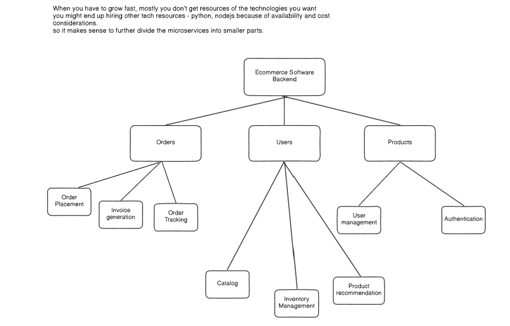
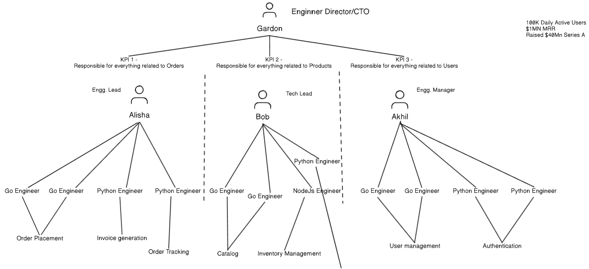

The company enters a hyper-growth phase after raising a Series A, which creates new technical and organizational challenges.

- `The Motivation`: The business experiences 10x growth. To scale the team rapidly, the company must hire engineers with diverse technical skills (e.g., Python, Node.js) based on availability and cost. A monolithic or macroservice architecture makes it difficult to integrate different technology stacks.

- `Architectural Change`: To enable parallel work and accommodate diverse technologies, the macroservices are further decomposed into fine-grained, single-responsibility microservices.

`Examples of Decomposition`:

- The Orders macroservice is broken down into Order Placement, Invoice generation, and Order Tracking.

- The Products macroservice is broken down into Catalog, Inventory Management, and Product recommendation.

- `Outcome`: This final structure allows smaller, specialized teams to own individual components. It supports using the best technology for each specific job and allows teams to deploy independently, which is critical for maintaining velocity in a rapidly scaling company.

# Technical Founder/CTO's View

From the perspective of a Technical Founder or CTO, architectural decisions are critical for system reliability and business agility. These diagrams contrast how monolithic and microservice architectures handle common operational challenges like bugs, security threats, and innovation.

## The Monolithic Challenge: A Single Point of Failure
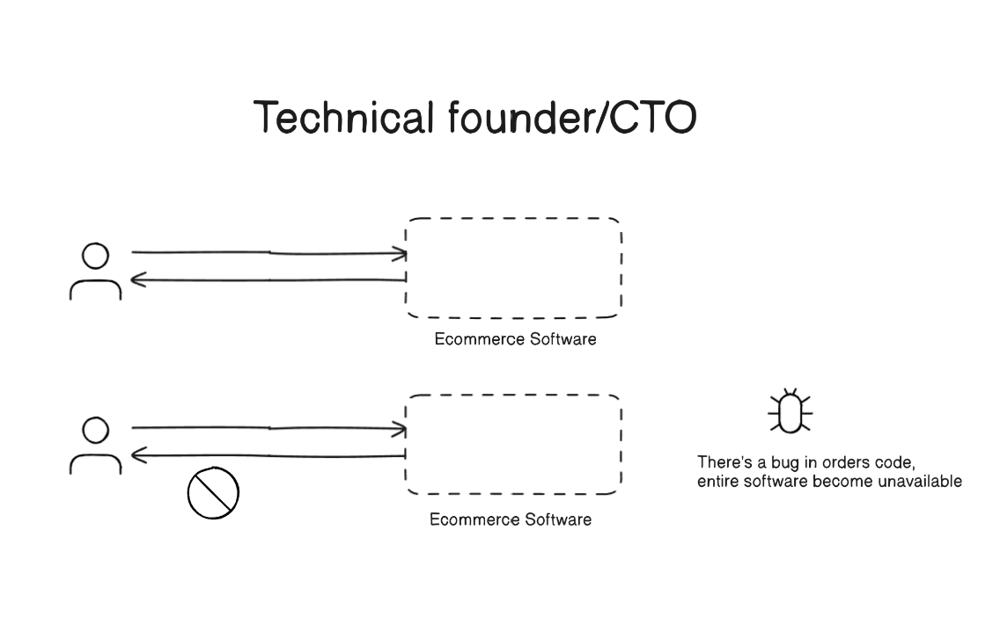
The first diagram illustrates a key vulnerability of monolithic systems, which is a major concern for anyone responsible for system uptime.

- `Scenario`: A bug is introduced into the code related to the orders functionality.

- `Impact`: Because all components are tightly coupled in a single process, the "entire software become unavailable." A failure in one part of the application leads to a complete system outage.

- `Key Takeaway`: This lack of fault isolation means that a non-critical error can have a catastrophic impact on the overall user experience and business operations.

## The Microservices Advantage: Resilience and Agility
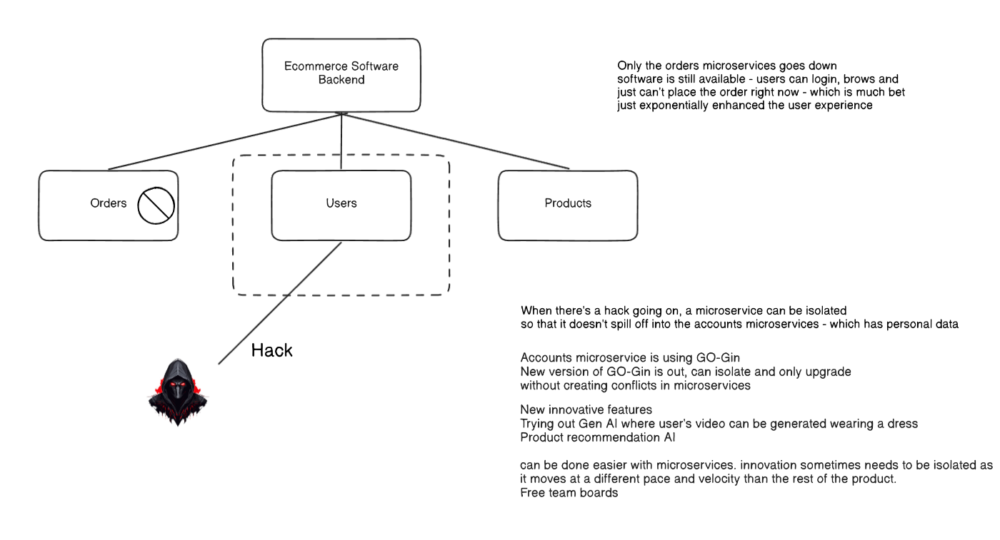
The second diagram shows how decomposing the system into services for Orders, Users, and Products addresses the monolithic challenges and unlocks new capabilities.

### Enhanced Fault Tolerance
When an issue occurs in one service, the impact is contained.

- `Scenario`: The Orders microservice goes down due to a bug or failure.

- `Impact`: The software remains available. As the diagram notes, "users can login, browse and just can't place the order right now."

- `Key Takeaway`: This graceful degradation provides a much better user experience. The system is resilient because the failure of one component does not bring down the entire application.

### Improved Security via Isolation
Microservices provide boundaries that can help contain security threats.

- `Scenario`: A hack targets the Users service.

- `Impact`: The service can be isolated to prevent the attack from spreading to other services that contain different data.

- `Key Takeaway`: This isolation acts as a "bulkhead," containing the damage from a security breach and protecting other parts of the system.

### Independent Innovation and Upgrades
The decoupled nature of microservices fosters agility and technological evolution.

- `Independent Upgrades`: A single service can be updated with a new technology or library version (e.g., upgrading the Accounts microservice to a new version of GO-Gin) without impacting any other service.

- `Isolated Innovation`: New, experimental features (like a "Gen AI" virtual try-on or a Product recommendation AI) can be developed and deployed within a dedicated service. This allows teams to innovate at a different pace without risking the stability of the core product.

# The Tech Architect's View: Core Architectural Decisions

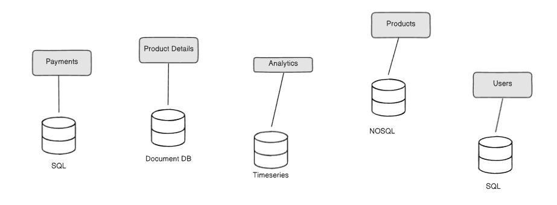
From the Tech Architect's perspective, designing a robust, scalable, and adaptable system involves a series of deliberate technical decisions. This document outlines the core strategies chosen for our platform's programming languages, data persistence models, communication patterns, and cloud infrastructure.

## 1. Polyglot Strategy: Using the Right Tool for the Job

[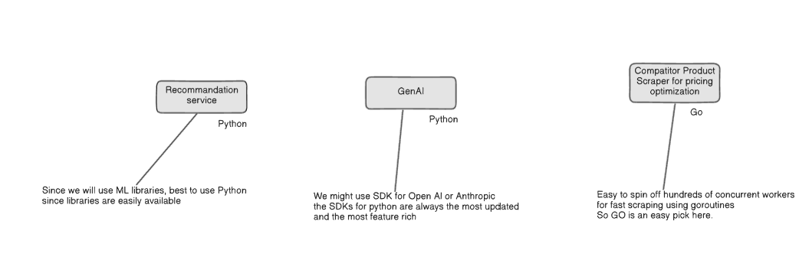]
We will not be constrained by a single technology stack. Instead, we will adopt a polyglot (multi-technology) approach to optimize for the specific needs of each service.

### Polyglot Programming
The choice of programming language is dictated by the problem domain and the available ecosystem.

- `Python`: The clear choice for Machine Learning and AI services (Recommendation, GenAI) due to its extensive libraries and mature, feature-rich SDKs for platforms like OpenAI and Anthropic.

- `Go`: Selected for high-concurrency tasks like the Competitor Scraper service. Its native support for goroutines makes it exceptionally efficient for spinning off hundreds of concurrent workers for I/O-bound tasks.

### Polyglot Persistence
Each microservice will own its own database, and the database technology will be chosen based on the service's specific data model and access patterns.

- `SQL`: Used for services requiring strong transactional consistency and relational data, such as Payments and Users.

- `Document DB`: Ideal for Product Details, where a flexible, semi-structured schema is more important than rigid relational constraints.

- `Timeseries DB`: Chosen for the Analytics service to efficiently store, query, and aggregate time-stamped event data.

- `NoSQL`: A general-purpose NoSQL database will be used for the Products catalog to prioritize a flexible schema and high read performance.

## 2. Inter-Service Communication: Synchronous vs. Asynchronous
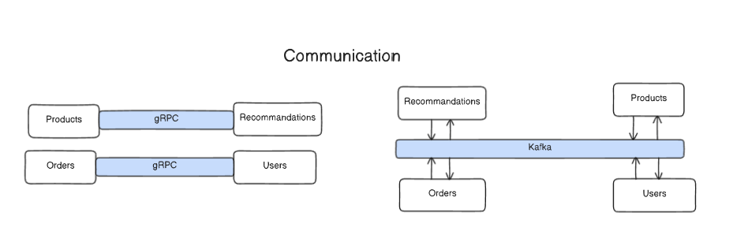
Our communication strategy employs two distinct patterns to balance performance, coupling, and resilience.

- `Synchronous (gRPC)`: Used for direct, low-latency, request-response interactions where an immediate answer is required. This is ideal for tightly-coupled calls, such as the Orders service querying the Users service for customer information.

- `Asynchronous (Kafka)`: Used for decoupled, event-driven communication. Services publish events to a central event bus (Kafka), allowing other services to react to those events without any direct dependency. This pattern enhances system resilience and scalability.

## 3. System Workflow: Defining the Information Flow
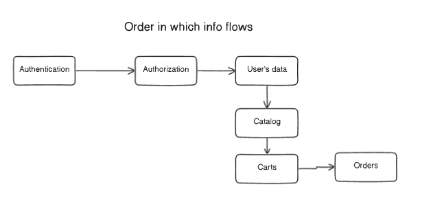
We have clearly mapped the critical path for core user interactions to ensure a coherent system-wide workflow. The defined sequence (Authentication → Authorization → User's data → Catalog → Carts → Orders) dictates the chain of service calls required to fulfill a key business process from start to finish.

## 4. Infrastructure: A Multi-Cloud Approach
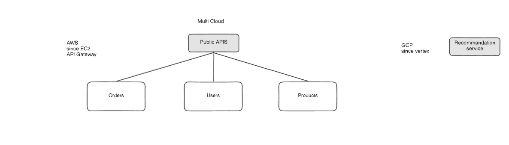
To leverage best-in-class services from different vendors, we are adopting a strategic multi-cloud approach.

- `Amazon Web Services (AWS)`: Will host our core transactional services (Orders, Users, Products) and expose them via Public APIs, likely using a combination of EC2 for compute and API Gateway for request routing.

- `Google Cloud Platform (GCP)`: Will be used for specialized, best-in-class workloads. For example, the Recommendation service will be deployed on GCP's Vertex AI platform to take advantage of its superior Machine Learning capabilities.

# Developer & DevOps Perspectives on Microservices

Beyond high-level architectural patterns, the choice of microservices has profound, practical implications for the teams building and running the system. This document explores the specific challenges and considerations from the viewpoint of Software Engineers, Indie Developers, and DevOps professionals.

## The Software Engineer's Lens: Data and Project Structure
For software engineers working day-to-day, a microservices environment presents unique challenges that require careful planning in data modeling and code organization.

### Data Schema Challenges
Schema Complexity: Designing schemas with minimal nested references is a difficult but crucial task to avoid latency and complexity in data fetching.

- `CRUD Operations`: Performing standard Create, Read, Update, and Delete (CRUD) operations on deeply nested data structures is complex and inefficient.

- `Frontend Payload`: Transforming backend data into a JSON format that is optimized for frontend display is a significant challenge, as excessive processing can overload application servers.

### Project Structure Considerations
- `Deliberate Design`: Project structures must be meticulously planned to accommodate scaling and prevent code chaos as the number of services grows.

- `Code Organization`: Finding a predictable way to handle unavoidable code repetition across different services is essential for maintainability.

- `Team Onboarding`: The structure must be clear enough to allow new team members to become productive as quickly as possible. Following industry standards is highly recommended over reinventing custom solutions.

## The Indie Developer's Lens: Security and Scoped Collaboration
Indie developers operate under a unique set of constraints: low budgets, limited resources, and the need to be nimble while protecting their intellectual property.

- `The Challenge`: They often need to collaborate with external or freelance developers but cannot risk giving them access to the entire codebase for security reasons.

- `The Microservice Solution`: This architecture is described as a "great option" because it provides natural boundaries. An indie developer can grant a freelancer access to a single microservice repository (e.g., only the Orders service) without exposing the logic of the entire system. This enables secure, scoped collaboration.

## The DevOps Lens: The Complexity of Centralized Logging
From a DevOps perspective, system observability is paramount. The provided diagram illustrates a critical operational task: centralized logging in a containerized environment managed by an orchestrator like Kubernetes.

In a distributed system, logs are generated from many independent services and infrastructure layers. To effectively troubleshoot and monitor the application, these logs must be collected and aggregated in a central location. This requires gathering comprehensive data from multiple levels:

- `Cluster Level Logs` (from the orchestrator, e.g., Kubernetes)

- `Container Level Logs` (from the runtime, e.g., Docker)

- `Application Level Logs` (from the actual service code)

- `OS Level Logs` (from the underlying host machine)