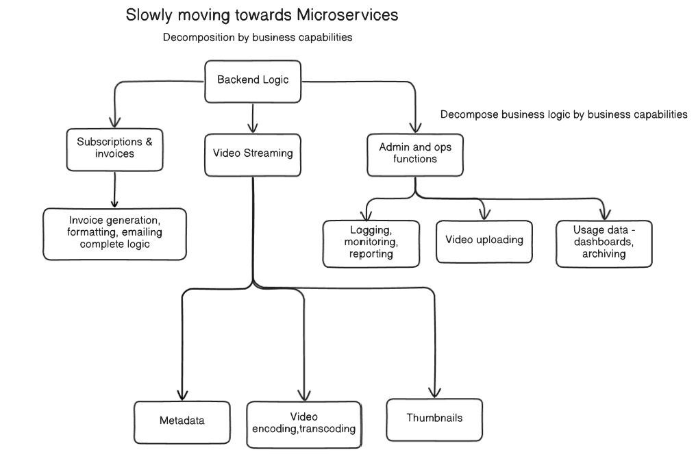
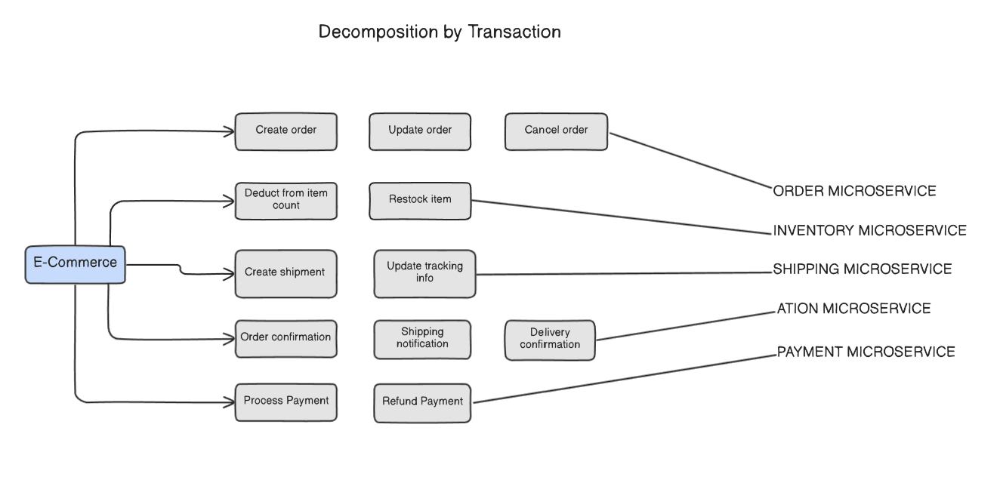
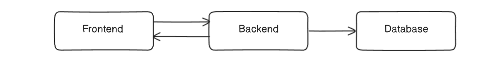
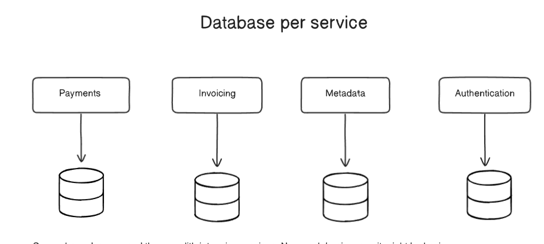
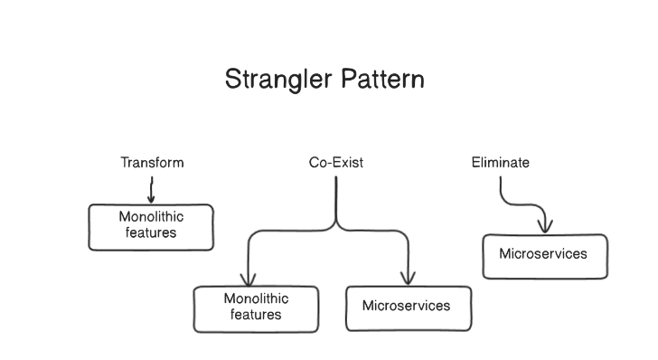

# Decomposing the Monolith: Strategies, Patterns, and Challenges

Transitioning from a monolithic application to a microservices architecture is a strategic process that involves careful planning. This document outlines the ideal characteristics of microservices, common decomposition strategies, the challenges that arise, and the key architectural patterns used to mitigate them.

## 1. The Goal: Ideal Microservice Characteristics
Before starting a decomposition, it's important to understand the target state. An ideal microservice is:

- `Highly Testable`: Small and focused, making it easy to write comprehensive tests.

- `Loosely Coupled`: Has minimal dependencies on other services.

- `Independently Deployable`: Can be released to production without requiring other services to be deployed simultaneously.

- `Organized around Business Capabilities`: Aligned with a specific business domain, following the principles of Domain-Driven Design (DDD).

- `Owned by a small team`: A single, empowered team is responsible for the entire lifecycle of the service.

A common question is about the limit on the number of microservices. There is no magic number. The key principle is that the number of services should be proportional to the size and structure of the engineering team. A team of 10 engineers with 25 microservices is likely a sign of over-decomposition, while large companies like Netflix (1,000+ services) and Uber (4,500+ services) operate effectively at a massive scale because their team size justifies it.

## 2. Decomposition Strategies: How to Split the Monolith
There are several proven strategies for breaking down a monolithic application.

### Decomposition by Business Capability
This is one of the most common approaches, where the monolith's logic is divided according to the different domains it serves. For example, a video platform's backend logic could be broken down into high-level capabilities like Video Streaming and Subscriptions & Invoices, which are then further decomposed into more granular services like Video encoding, Metadata, and Invoice generation.

### Decomposition by Transaction

Another effective method is to analyze the user-facing transactions and group related actions into a single service. In an e-commerce application, actions like "Create order" and "Cancel order" would belong to an Order Microservice, while "Process Payment" and "Refund Payment" would belong to a Payment Microservice.

## 3. Common Challenges in a Microservices World
While powerful, this architecture is not a perfect solution and introduces its own set of challenges.

The "Big Ball of Mud": If communication between microservices is not carefully managed, it can lead to a chaotic web of inter-service requests. This recreates the tight coupling and complexity of a monolith, just in a distributed form.

`Latency and Client-Side Complexity:`

- `Latency`: Communication between services happens over the network. The increased number of calls required to fulfill a single user request can lead to higher overall latency compared to an in-process monolith.

- `Client Complexity`: The frontend or client application often needs to fetch data from multiple microservices to render a single screen. This forces the client to contain complex logic for making multiple requests and stitching the data together, which can slow it down.

## 4. Key Architectural Patterns for Mitigation
To address these challenges, architects rely on several well-established patterns.

### The Database per Service Pattern

This is a fundamental pattern for ensuring loose coupling.

- `Principle`: Each microservice owns and manages its own private database. Other services cannot access this database directly.

`Benefits`:

- `Enforces Loose Coupling`: Services can only communicate via their public APIs, not by sharing a database.

- `Polyglot Persistence`: Each team can choose the best database technology for its service's specific needs (e.g., SQL for payments, NoSQL for a product catalog).

- `Isolates Compliance`: Sensitive data (like PII in a Payments service) is isolated, which can simplify security and compliance efforts.

### The Strangler Fig Pattern

This pattern provides a safe, incremental strategy for migrating from a monolith to microservices.

`Principle`: Instead of a risky "big bang" rewrite, new microservices are built to "strangle" the old monolith over time.

`Phases`:

- `Transform/Co-Exist`: A new microservice is built and runs alongside the existing monolith. Traffic for a specific feature is gradually routed from the monolith to the new service.

- `Eliminate`: Once the new microservice has completely taken over the functionality, the old code in the monolith is removed.

`Benefit`: This ensures a gradual and low-risk migration, avoiding service disruptions.