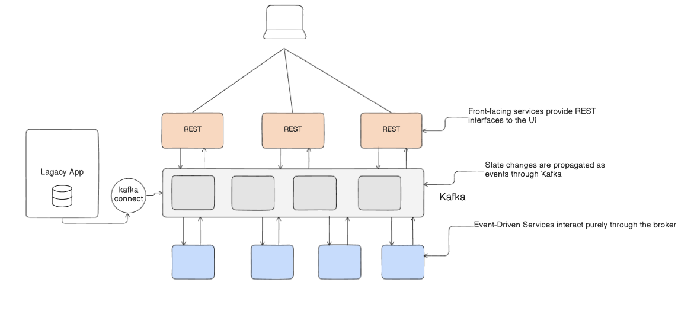
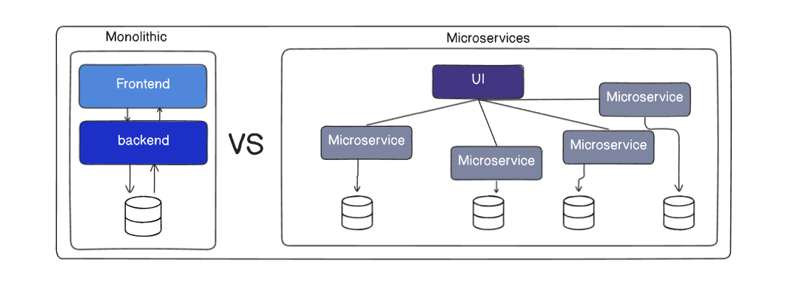
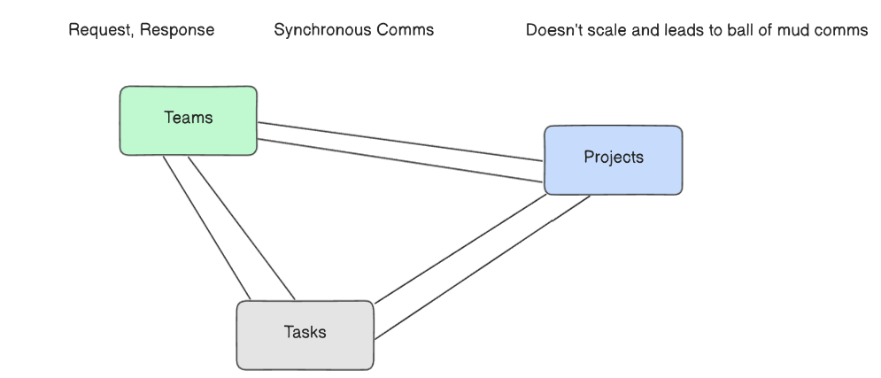
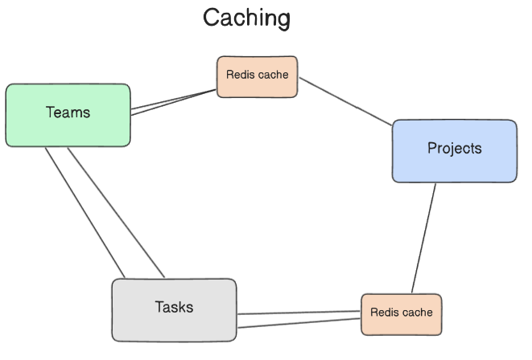
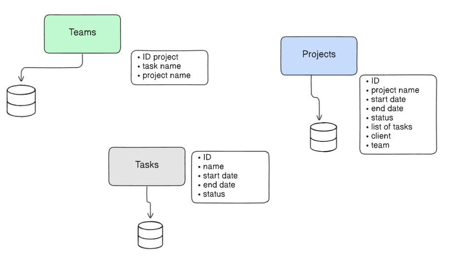
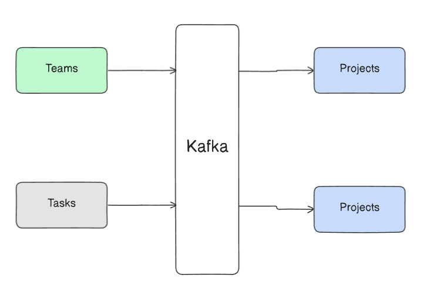

# Evolving Inter-Service Communication: From Synchronous to Event-Driven

The communication pattern between microservices is one of the most critical architectural decisions. While simple request-response communication is easy to start with, systems often evolve towards more resilient and scalable event-driven patterns as they mature. This document outlines this evolutionary path.

# The Foundational Shift: Monolith vs. Microservices
Before discussing communication, it's essential to understand the structural change shown in the diagrams.

## General Lifecycle of a system

### Monolith systems with some services (not a pure monolith)

1. Things usually start off as synchronous systems with HTTP but HTTP requests start having lag and delays.
2. In traditional systems, client makes HTTP requests to server then gets response back.
3. Streaming systems make it easy for everyone to be in sync without specifically making requests.
4. So, systems tend to become more event driven with time as traffic and data increases and no. of requests start burgeoning.
5. For a while, architects also try partially being request driven and partially event driven, and this is how it looks.
6. But eventually, they may become completely event driven

### Microservices

- When teams grow and the product matures and the traffic increases.
These are independent event but mostly happen at the same time.
This calls for a new way of dealing with this challenge.

- Different technologies are great for different services, you may want to build services heavy with computations in GO, scraping services in python and general services in node also, you might only get few engineers of a technology and you'd want to keep your system language agnostic.

- For such evolved systems, where there's loose coupling and high separation of concern, you'd want to consider microservices.

- Architecting REST API based microservices or synchronous microservices is easy, straightforward and at a small scale the right thing to start with and at a small scale, everything works perfectly fine.
but soon there will be challenges with synchronous microservices - all microservices exclusively own their own data so if one service wishes to access data help by another, it must do so using an API call.
when numerous services access the same piece of data, things get tricky, to complicate matters further, you may have microservices that utilize heterogeneous databases, i.e multiple types of DBs like SQL, NoSQL, timeseries.

- maintaining data integrity can be an issue when the requests don't scale from APIs

- Instead of API calls, we want the systems to being driven by events, where events are streamed between the microservices and they pick up events that are important to them while ignoring the others. Based on the events, there could be triggers that take specific action.

## 1. The Challenge: The "Big Ball of Mud" of Synchronous Communication

Initially, services often communicate using direct, synchronous, request-response API calls (e.g., REST or gRPC).

The Pattern: One service makes a direct request to another and waits for a response. As shown in the diagrams, this can lead to a state where Teams, Projects, and Tasks services are all directly calling each other.

`The Problem`: This approach creates tight coupling between services. As the diagram notes, it "doesn't scale and leads to ball of mud comms." A failure or slowdown in one service can cascade and impact all dependent services, creating a fragile system.

## 2. Tactical Solutions to Reduce Synchronous Calls
To mitigate the issues of tight coupling and latency, teams often adopt tactical patterns to reduce the number of direct API calls.

- `Caching`: A simple way to improve performance is to introduce a cache (e.g., Redis). Instead of always fetching data directly from a service, clients can get it from the cache. This reduces latency but introduces the challenge of keeping the cache updated.

- `Redundant Data Storage`: Another approach is for a service to store a local copy of data it frequently needs from another service. For example, the Teams service might store the project name to avoid repeatedly calling the Projects service. This reduces API calls but creates a new problem: keeping the redundant data synchronized.

## 3. The Strategic Solution: Event-Driven Architecture
While caching and data redundancy help, the most robust solution for decoupling services is to adopt an event-driven architecture using a message bus.

- `The Publisher-Subscriber Model`: Instead of calling each other directly, services communicate asynchronously through a central messaging interface like Kafka or RabbitMQ.

    - One service publishes an event (e.g., "ProjectCreated") to the bus.

    - Other services can subscribe to the events they are interested in and react accordingly.

- `Benefits`: This completely decouples the services. The publishing service has no knowledge of the subscribing services, allowing them to evolve independently.

- `Eventing Beyond the Backend`: This pattern is not limited to backend communication. As noted in the diagrams, event streams can also be used between the frontend and backend (e.g., using WebSockets) for real-time UI updates, reducing the need for API polling.
